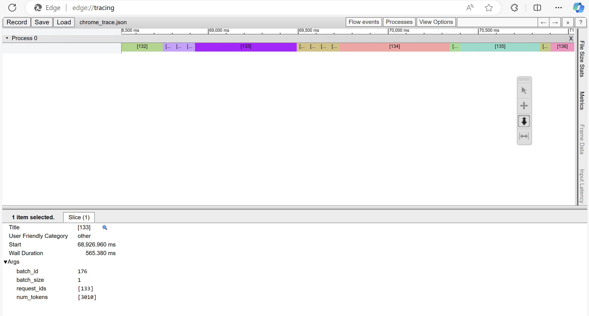

# Vidur: LLM Inference System Simulator Vidur：大型语言模型（LLM）推理系统模拟器

Vidur is a high-fidelity and extensible LLM inference system simulator. It can help you with:
Vidur 是一个高保真且可扩展的大型语言模型（LLM）推理系统模拟器。它可以帮助您：

1. Study the system performance of models under different workloads and configurations.
   在不同的工作负载和配置下研究模型的系统性能。

    | TTFT | TPOT | Request E2E Time | Batch Size |
    *`Llama-3-8B` running the [AzureLLMInferenceTrace2023_conv] trace on single `A100 80GB` at 6.45 QPS

   | TTFT | TPOT | 请求端到端时间 | 批次大小 |
   *`Llama-3-8B` 在单张 `A100 80GB` 上以 6.45 QPS 运行 [AzureLLMInferenceTrace2023_conv] Trace 获得的结果


2. Capacity planning and finding the best deployment configuration for your LLM deployments.
   进行容量规划并为您的 LLM 部署找到最佳的部署配置。

   ![Config Search 配置搜索]](./assets/llama70b_Chat1M_ttft_tbt_90_99_2.0_0.2.jpeg)
   *Capacity per dollar for different deployment configurations vs TTFT-P90 and TBT-P99 for LLaMA2-70B.*
   *不同部署配置的每美元容量对比 TTFT-P90 和 TBT-P99 对于 LLaMA2-70B.*

    
3. Quickly test new research ideas like new scheduling algorithms, optimizations like speculative decoding, etc.
    快速测试新的研究思路，如新的调度算法、优化措施如预测性解码等

... all without access to GPUs except for a quick initial profiling phase 🎉. We highly recommend checking out our [MLSys'24 paper](https://arxiv.org/abs/2405.05465) and [talk](https://mlsys.org/virtual/2024/poster/2667) for more details
   ...所有这些操作都不需要 GPU 访问，除了一个快速的初始性能分析阶段 🎉。我们强烈建议您查看我们的 [MLSys'24 论文](https://arxiv.org/abs/2405.05465) 和 [演讲](https://mlsys.org/virtual/2024/poster/2667) 以获取更多详细信息。


## Supported Models 支持的模型

__Instructions on adding a new model to existing or new SKUs can be found [here](docs/profiling.md)__.
_添加新模型到现有或新的 SKU 的说明可以在此[文档](docs/profiling.md)中找到_。

| 模型/设备 | A100 80GB DGX | H100 DGX | 4xA100 80GB 对节点 NVLink | 8xA40 对节点 NVLink |
| Model / Device | A100 80GB DGX | H100 DGX | 4xA100 80GB Pairwise NVLink Node | 8xA40 Pairwise NVLink Node |
| --- | --- | --- | --- | --- |
| `meta-llama/Meta-Llama-3-8B` | ✅ | ❌ | ✅ | ❌ |
| `meta-llama/Meta-Llama-3-70B` | ✅ | ❌ | ✅ | ❌ |
| `meta-llama/Llama-2-7b-hf` | ✅ | ✅ | ✅ | ✅ |
| `codellama/CodeLlama-34b-Instruct-hf"` | ✅ | ✅ | ✅ | ✅ |
| `meta-llama/Llama-2-70b-hf` | ✅ | ✅ | ✅ | ✅ |
| `internlm/internlm-20b` | ✅ | ✅ | ✅ | ✅ |
| `Qwen/Qwen-72B` | ✅ | ✅ | ✅ | ✅ |

* All models support a maximum context length of 4k except `Llama3-8B` and `Llama3-70B` which support 16k context length by passing additional CLI params:
* 除了 `Llama3-8B` 和 `Llama3-70B` 支持 16k 上下文长度外，所有模型都支持最大 4k 上下文长度，通过传递额外的 CLI 参数：

    ```text
    --random_forrest_execution_time_predictor_config_prediction_max_prefill_chunk_size 16384 \
    --random_forrest_execution_time_predictor_config_prediction_max_batch_size 512 \
    --random_forrest_execution_time_predictor_config_prediction_max_tokens_per_request 16384
    ```

* Pipeline parallelism is supported for all models. The PP dimension should divide the number of layers in the model.
* In DGX nodes, there are 8 GPUs, fully connected via NVLink. So TP1, TP2, TP4 and TP8 are supported.
* In 4x pairwise NVLink nodes, there are 4 GPUs, so TP1, TP2 and TP4 are supported. TP4 here is less performant than TP4 in DGX nodes because (GPU1, GPU2) are connected via NVLink and (GPU3, GPU4) are connected via NVLink. but between these layers, the interconnect is slower.
* You can use any combination of TP and PP. For example, you can run LLaMA2-70B on TP2-PP2 on a 4xA100 80GB Pairwise NVLink Node.

* 所有模型都支持流水线并行。PP 维度应该能够整除模型的层数。
* 在 DGX 节点中，有 8 个 GPU，通过 NVLink 完全连接。因此支持 TP1、TP2、TP4 和 TP8。
* 在 4x 对节点 NVLink 中，有 4 个 GPU，所以支持 TP1、TP2 和 TP4。这里的 TP4 性能不如 DGX 节点中的 TP4，因为（GPU1, GPU2）通过 NVLink 连接，（GPU3, GPU4）通过 NVLink 连接，但这些层之间的互连速度较慢。
* 您可以使用任何组合的 TP 和 PP。例如，您可以在 4xA100 80GB 对节点 NVLink 上以 TP2-PP2 运行 LLaMA2-70B。


## Setup 设置

### Using `mamba` 使用 mamba

To run the simulator, create a mamba environment with the given dependency file. 要运行模拟器，请使用给定的依赖文件创建一个 mamba 环境。

```sh
mamba env create -p ./env -f ./environment.yml
mamba env update -f environment-dev.yml
```

### Using `venv`

1. Ensure that you have Python 3.10 installed on your system. Refer <https://www.bitecode.dev/p/installing-python-the-bare-minimum>
2. `cd` into the repository root
3. Create a virtual environment using `venv` module using `python3.10 -m venv .venv`
4. Activate the virtual environment using `source .venv/bin/activate`
5. Install the dependencies using `python -m pip install -r requirements.txt`
6. Run `deactivate` to deactivate the virtual environment

确保系统安装了 Python 3.10. 请参阅 https://www.bitecode.dev/p/installing-python-the-bare-minimum
进入仓库根目录
使用 venv 模块创建虚拟环境：python3.10 -m venv .venv
使用 source .venv/bin/activate 激活虚拟环境
使用 python -m pip install -r requirements.txt 安装依赖
运行 deactivate 以停用虚拟环境

### Using `conda` (Least recommended) 使用 conda (不推荐)

To run the simulator, create a conda environment with the given dependency file. 要运行模拟器，请使用给定的依赖文件创建一个 conda 环境。

```sh
conda env create -p ./env -f ./environment.yml
conda env update -f environment-dev.yml
```

```sh
fth
conda env create -p ./env -f ./environment.yml
conda env update -f environment-dev.yml
conda env update -f environment.yml

conda activate vidur
pip install -r requirements-dev.txt 
pip install -r requirements.txt 
pip install -r requirements.txt -i https://mirrors.aliyun.com/pypi/simple/
pip install -r requirements-dev.txt https://mirrors.aliyun.com/pypi/simple/
```

### Setting up wandb (Optional) 配置 wandb (可选)


First, setup your account on `https://<your-org>.wandb.io/` or public wandb, obtain the api key and then run the following command, 
首先，在 https://<your-org>.wandb.io/ 或公共 wandb 上设置您的帐户，获取 API 密钥，然后运行以下命令：


```sh
wandb login --host https://<your-org>.wandb.io
```

To opt out of wandb, pick any one of the following methods:
如需退出 wandb，请选择以下任一方法：

1. `export WANDB_MODE=disabled` in your shell or add this in `~/.zshrc` or `~/.bashrc`. Remember to reload using `source ~/.zshrc`.
2. Set `wandb_project` and `wandb_group` as `""` in `vidur/config/default.yml`. Also, remove these CLI params from the shell command with which the simulator is invoked.
在 shell 中 export WANDB_MODE=disabled 或将其添加到 ~/.zshrc 或 ~/.bashrc 中。记得使用 source ~/.zshrc 重新加载。
在 vidur/config/default.yml 中将 wandb_project 和 wandb_group 设置为 ""。同时，从执行模拟器的 shell 命令中删除这些 CLI 参数。

## Running the simulator  运行模拟器

To run the simulator, execute the following command from the repository root, 要运行模拟器，请在仓库根目录下执行以下命令：

```sh
python -m vidur.main
```


or a big example with all the parameters, 或使用包含所有参数的大例子：

```sh
python -m vidur.main  \
--replica_config_device a100 \
--replica_config_model_name meta-llama/Meta-Llama-3-8B \
--cluster_config_num_replicas 1 \
--replica_config_tensor_parallel_size 1 \
--replica_config_num_pipeline_stages 1 \
--request_generator_config_type synthetic \
--synthetic_request_generator_config_num_requests 512  \
--length_generator_config_type trace \
--trace_request_length_generator_config_max_tokens 16384 \
--trace_request_length_generator_config_trace_file ./data/processed_traces/splitwise_conv.csv \
--interval_generator_config_type poisson \
--poisson_request_interval_generator_config_qps 6.45 \
--replica_scheduler_config_type sarathi  \
--sarathi_scheduler_config_batch_size_cap 512  \
--sarathi_scheduler_config_chunk_size 512 \
--random_forrest_execution_time_predictor_config_prediction_max_prefill_chunk_size 16384 \
--random_forrest_execution_time_predictor_config_prediction_max_batch_size 512 \
--random_forrest_execution_time_predictor_config_prediction_max_tokens_per_request 16384
```


用这个网址打开
chrome://tracing/

or to get information on all parameters, 或获取所有参数信息：

```sh
python -m vidur.main -h
```

## Running vidur-search （fth写）
vidur-search可以运行的命令

python -m vidur.config_optimizer.config_explorer.main --output-dir  /app/software1/vidur/test_fth --config-path /app/software1/vidur/vidur/config_optimizer/config_explorer/config/config.yml


## Simulator Output 模拟器输出

* The metrics will be logged to wandb directly and a copy will be stored in the `simulator_output/<TIMESTAMP>` directory. __A description of all the logged metrics can be found [here](docs/metrics.md).__
* Vidur exports chrome traces of each simulation. The trace can be found in the `simulator_output` directory. The trace can be opened by navigating to `chrome://tracing/` or `edge://tracing/` and loading the trace.

    


指标将直接记录到 wandb，并在 simulator_output/<时间戳> 目录下存储一份副本。所有记录的指标的描述可以在此文档中找到。
Vidur 导出每次模拟的 Chrome 跟踪数据。跟踪文件可以在 simulator_output 目录下找到。通过导航到 chrome://tracing/ 或 edge://tracing/ 并加载跟踪文件，可以打开跟踪数据。
./assets/chrome_trace.png

## Formatting Code

To format code, execute the following command: 要格式化代码，请执行以下命令：

```sh
make format
```

## Contributing

This project welcomes contributions and suggestions.  Most contributions require you to agree to a
Contributor License Agreement (CLA) declaring that you have the right to, and actually do, grant us
the rights to use your contribution. For details, visit https://cla.opensource.microsoft.com.

When you submit a pull request, a CLA bot will automatically determine whether you need to provide
a CLA and decorate the PR appropriately (e.g., status check, comment). Simply follow the instructions
provided by the bot. You will only need to do this once across all repos using our CLA.

This project has adopted the [Microsoft Open Source Code of Conduct](https://opensource.microsoft.com/codeofconduct/).
For more information see the [Code of Conduct FAQ](https://opensource.microsoft.com/codeofconduct/faq/) or
contact [opencode@microsoft.com](mailto:opencode@microsoft.com) with any additional questions or comments.

## Trademarks

This project may contain trademarks or logos for projects, products, or services. Authorized use of Microsoft 
trademarks or logos is subject to and must follow 
[Microsoft's Trademark & Brand Guidelines](https://www.microsoft.com/en-us/legal/intellectualproperty/trademarks/usage/general).
Use of Microsoft trademarks or logos in modified versions of this project must not cause confusion or imply Microsoft sponsorship.
Any use of third-party trademarks or logos are subject to those third-party's policies.

贡献

我们欢迎对该项目的贡献和建议。大多数贡献需要您同意一份贡献者许可协议（CLA），声明您有权利并确实授予我们使用您贡献的权利。详情请访问 https://cla.opensource.microsoft.com。

当您提交一个拉取请求时，CLA 机器人会自动确定您是否需要提供 CLA，并适当地标注 PR（例如，状态检查、评论）。请按照机器人提供的说明进行操作。对于所有使用我们 CLA 的仓库，您只需执行一次。

本项目已采用 Microsoft 开源行为准则。欲了解更多信息，请参见 行为准则常见问题 或联系 opencode@microsoft.com 获取任何其他问题或评论。

商标

本项目可能包含项目、产品或服务的商标或徽标。使用 Microsoft 商标或徽标的授权使用必须遵循 Microsoft 的商标和品牌指南。在修改版本的项目中使用 Microsoft 商标或徽标不得引起混淆或暗示 Microsoft 赞助。任何使用第三方商标或徽标的行为都需遵循第三方的政策